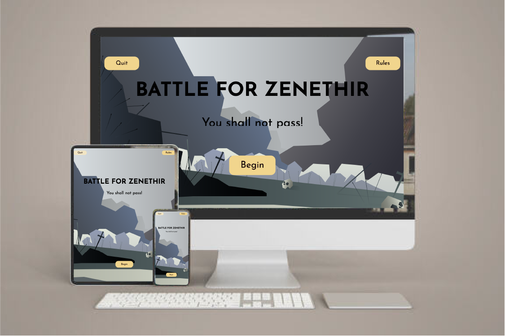
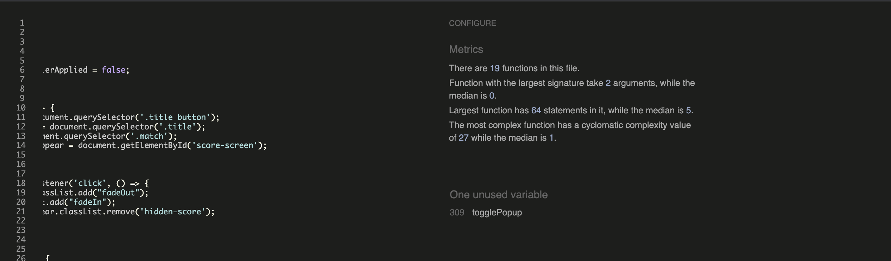
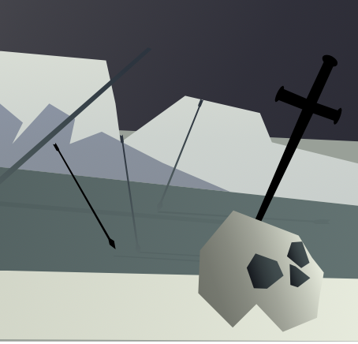

# Battle for Zenethir

[Please visit the website here.](https://stuartpkd.github.io/Battle-for-Zenethir/)

I created this game to demonstrate my understanding and aptitude for Javascript. I have played a lot of real-time strategy games throughout my life. I always liked the idea of certain units countering others. There was always an aspect of rock paper scissors to it. So I felt rebranding rock paper scissors to have a real-time strategy aspect to it would work well.

Battle for Zenethir is a single web page made up of these sections:

1. Start/Title screen.
2. Match section.
3. Score section.
4. Choices section. 
5. Win/Lose screen.

Site owner's goals:

1. Create a fun game loop to keep the player interested in the game.
2. Allow the player to make choices as to which unit they will send.
3. Allow the player to quit after winning or losing.
4. Add difficulty to the game so the player can win/ be defeated.
5. Allow the player to check the rules whenever they need. 

User goal's:

1. As a first-time visitor: I want to check the rules of the game.
2. As a first-time visitor: I want to play a game with a fun probability aspect to it.
3. As a first-time visitor: I want to beat the computer in a game of probability.
4. As a recurring or first-time visitor: I want to be able to quit the game at any time.
5. As a recurring or first-time visitor: I want to be able to play again after winning/losing.

# UX / UI

## Strategy 

After thinking about the strategy for my site. I came up with a target audience, which would influence the features included.

### Target users:

1. 18-40 years old.
2. Interested in RTS (Real Time strategy) games.
3. People interested in probability.
4. People interested in fantasy settings.
5. People interested in appealing art styles.

### What the user would look for:

* Easy to understand and visually appealing art style.
* A simple and clean site (Easy to navigate).
* An addictive game loop.
* An easy to understand list of rules.
* An ability to leave the game at any time.
* A fun game based on probability.

I really love simple and clean website designs, so I tried to achieve that with mine. The artwork is flat and doesn't try to call too much attention to itself. The UI is simple and stands out against the background. With the simple layout, it helps when making it responsive for mobile and tablet users. 

## Scope

To help the user achieve their desired experience, these features were included:

* A simple and visually appealing art syle was created to keep the user entertained.
* A quit button to allow the user to stop at any time.
* A rules section for the user to understand the games rules.
* A simple score system that would encourage the player to beat the computer.
* A series of choices allowing the user to rely on probability.
* A fun randomly generated slogan at the main title. (For people interested in fantasy.)

## Structure 

This is a single web page. It contains the title screen which introduces the player to the theme and setting. The rules section shows the player which unit beats another. As well as an explanation of the game. The quit button gives the player the chance to leave whenever they like. The choice section presents all of the units that the player and computer will choose in a match. The match section displays images based on the choices of the computer and user. The score section indicates who is winning and who is close to defeating their enemy. Lastly, the victory and defeat popups tell the player of their loss or win. 

The game was intended to have a fun aspect to it. With the simple game loop and the randomly generated slogans. I wanted to be able to dress up a game of rock paper scissors so much. That you would not realise you were playing it anymore.

### Skeleton 

#### Wireframes

[Desktop wireframe](assets/docs/desktop.pdf) [Tablet wireframe](assets/docs/tablet.pdf) [Mobile wireframe](assets/docs/mobile.pdf)

Please be aware, the wireframes may not represent the game accurately. As the game was subject to change as I was building it,I did not want to stray too far away from the wireframes. As they had a clean and simple layout, that would make designing it a much easier experience. A few features needed to be added, such as a quit button and a more sophisticated rules button. However, this did not affect the layout too much.

## Surface

I used a muted colour palette for the main background of the game. It gave a good 'battlefield' effect. But it also did not bring too much attention to itself. The units of the game were given a bright vibrant colour palette. One of the early difficulties was getting them to stand out in the background.

Here are some of the concept art ideas for the game when it was in early development. Use of gradients and color theory can give a good idea of depth in an image without having to animate anything.

Lastly, I used Josefin Sans as the font for the whole game. I thought it had a great look, but also gave off a good fantasy element to it.

The name for this game was created by a random fantasy name generator I created in GitHub. I could not come up with a decent one myself, so I made a function to make one for me.

## Features

This game was designed with a desktop in mind. However, it works very well on tablets and mobile. Some mobile users may suffer when it comes to the rules section. A template design was used throughout the game to make sure that the style and layout was consistent.

### Quit button

Pretty self explanitory. The button was added to make sure that the user could leave at any time.

### Random slogan generator

The title screen has a new slogan beneath it every time the page is loaded. I thought it added a fun aspect to the game. And could possibly encourage the user to return to the game frequently for new phrases.

### Rules button

The rules button allows the player to remind themselves of the context and rules of the game. The unit indicator image could use a little work. However, explaining the unit hierarchy in the text became far too bulky.

### Match section

This section is the bread and butter of the game. A function takes the choices of the player and the computer and compares them. It is laid out to give all of the choices breathing room. But also not too much as to block the immersive artwork in the background. The is another function that updates the images of the match, again based on the choices of the player and the computer. A text call to action allows the player to know who won that round.

### Score section

The score section appears at the top of the screen to keep the player updated on whos winning the game. The game is up to 5 points. The player will get a different message depending on the outcome. The score is incremented by the update score function and is called each time the player and computer make their choice.

### Victory and defeat sections

The victory and defeat screens show up when the player or the computer reaches 5 points. They are then presented with unique artwork for each outcome. As well as call to actions to return to the main menu. Or return to the battlefield to fight once again!

### Error 404 page

The file directory also contains an error 404 page to bring the user back to the home page.

## Future features

With more time I would have liked to have added some of these features. When I finish the full stack course, I intend on returning to this project to add some of them.

### Custom armies

It would be great to have a series of artworks for the player to choose from. I feel they could have bigger concern for their own army then. 

### Decisive victory and total defeat

I would like to add another if statement, stating that if the player or computer win by 5 points to none. A decisive victory or a total defeat screen would be shown. (The chances of this happening are 0.032%)

### Css animations for the choices

I think some animation for the unit choices could also really add to the game.

## Technologies

1. [Html](https://www.w3schools.com/html/)
Used to structure my webstie into basic building blocks.

2. [CSS](https://www.w3schools.com/css/)
This was then used to style all of my building blocks.

3. [Javascript](https://www.w3schools.com/js/)
Javascript was used to create the whole game.

4. [Google Fonts](https://fonts.google.com/)
I used this to find my fonts for the web page.

5. [Bro Code Rock Paper Scissors](https://www.youtube.com/watch?v=n1_vHArDBRA)
I used this tutorial to see how I would go about making my own game.

6. [Google Dev Tools](https://developer.chrome.com/docs/devtools/)
This was essential when designing the game, particularly with the responsiveness. As well as bug finding.

7. [GitHub](https://github.com/)
This was used to store all of my code safely.

8. [Git](https://git-scm.com/)
This allowed me to version control my code. As well as push and commit pieces to Github when I needed.

9. [Gitpod](https://www.gitpod.io/)
I used gitpod as my development environment.

10. [Illustrator](https://en.wikipedia.org/wiki/Adobe_Illustrator)
I used illustrator to create all the imagery for the game. As well as the wireframes.

11. [W3 School Html Validator](https://validator.w3.org/)
This validator made sure that there were no errors in my html code.

12. [W3 School CSS Validator](https://validator.w3.org/)
This validator made sure that there were no errors in my CSS code.

13. [Js Hint](https://jshint.com/)
Js hint helped me make sure there was no issues with my Js code.

13. [Colour Hunt](https://colorhunt.co/)
I use this as an extension in my browser. It really helps me find great colour palettes.

14. [Flex Box](https://www.w3schools.com/css/css3_flexbox.asp)
Flex box helped a lot when it came to the page layouts. 

15. [Code Institute](https://codeinstitute.net/ie/)
The code institute lessons were used many times to troubleshoot.

16. [Lighthouse](https://developer.chrome.com/docs/lighthouse/overview/)
I used google lighthouse to make sure that my page was accessable as possible.

17. [Slack](https://slack.com/intl/en-ie/)
Code institute slack channels were very important during this project.

## Testing

1. As a first-time visitor: I want to check the rules of the game.

The rules button is always displayed, apart from when the player has lost or won in the game. It is shown clearly in the top right-hand hand of the screen whenever they need to remind themselves of the rules. The rules popup has an overlay so as not to distract the user while they study. Then there is also an x button to return from the rules.

2. As a first-time visitor: I want to play a game with a fun probability aspect to it.

The game has a begin call to action in the main menu. This brings the user to the match section where again they are called to make a choice. They have a 1/5 chance of making the correct choice against the computer. This is a game of chance ultimately. The user continues to make choices until the score reaches 5. Resulting in victory or defeat. 

3. As a first-time visitor: I want to beat the computer in a game of probability.

The player must make the correct choices, enough to get their score to 5 to defeat the computer. The player can keep track of how they are doing at the stop of the screen in the score section.

4. As a recurring or first-time visitor: I want to be able to quit the game at any time.

While designing the game at its early stages, I completely overlooked the ability to quit the game. I thought it would be a poor design choice to ask the player to refresh the page. Now the player can quit whenever they need with the quit button. It resets the game and brings the user back to the title menu.

5. As a recurring or first-time visitor: I want to be able to play again after winning/losing.

The user may have likely been beaten by the computer and would like to play again. After losing or winning a match, they will be presented with two call to actions. One button will reset the game and bring you back to the title screen. The other will reset the scores and begin a new match against the computer.

A large part of testing the javascript durability in this project. Was sending it to all of my friends for them to break. It was a massive help when trying to spot any issues in the game.

## Lighthouse

My web page scored very high on Google Lighthouse. Lighthouse is an open-source, automated tool for improving the quality of web pages. You can run it against any web page, public or requiring authentication. It has audits for performance, accessibility, progressive web apps, SEO, and more. 

Using SVGs for my images really helped with the page loading time. As well as the simple and clean layout. 

## HTML, CSS and JS Validation

I validated my website during its development so as not to run into many issues towards the end. Luckily, there were not many errors throughout. One warning still remains in the index page. However, this is due to my use of the h2. I left it blank as this h2 is used for the random slogan generator.

### Index page

### Error page

### CSS

### JS

## Bugs

1. I had been using a class selector for my game reset function. I kept presenting an error in the console, saying that it was not a function. This is because I was pulling an array of elements and not just one single one. This was a big learning milestone for me. I ended up using id selectors from then on.

2. I am sad to put this bug here as I could not defeat it. I spent a lot of time trying to replicate it so I could figure out what was wrong. I would wait on the computer at different stages of the game and set a timer to catch it. However, it would always show completely erratically when I was not ready. It does not seem to affect the game in any way. So, sadly, it must stay in it for now. I tweaked all of the event listeners of my jd code to get it to stop to no avail.

3. A bug would come up with my svgs occasionally. The image would have random objects picked out and turned jet black. For some reason, this happens when you use the export screen tool in illustrator. Which is frustrating because I then had to go back and export individual artboards. Instead of doing them all at once. An easy but annoying fix.

## Deployment

I deployed my game to GitPages using these steps:

1. Sign into GitHub.
2. Select your project from your repositories.
3. At the top of your project select settings.
4. Navigate your way to the pages section of settings.
5. Select source and then select "Main" (It can also show up as master for some people)
6. Click save.
7. The page will generate a url, this will be where your page is hosted. (Be aware this may take a few minutes.)

## Credits

These are the sources that helped me make my way through this project. I used many pages for troubleshooting and wisdom when it came to creating my website.

### Researching and inspiration:

* [Awwwards](https://www.awwwards.com/)

* [Behance](https://www.behance.net/)

* [Web Developer Portfolios](https://www.hostinger.com/tutorials/web-developer-portfolio#1_Charles_Bruyerre)

### Code sources and tutorials:

* [Kevin Powell Tutorials](https://www.youtube.com/channel/UCJZv4d5rbIKd4QHMPkcABCw)

* [Bro Code](https://www.youtube.com/channel/UC4SVo0Ue36XCfOyb5Lh1viQ)

* [FlexBox](https://css-tricks.com/snippets/css/a-guide-to-flexbox/)

* [Web Layout Critiques](https://www.youtube.com/@Hyperplexed)

* [Popups](youtube.com/watch?v=iE_6pQ3RlZU)

### Content 

All of the content was written by me or was taken from of my favourite fantasy movies. Including Lord of the Rings.

## Acknowledgements

I would like to pass on a massive thank you to my mentor Harry Dhillon. He provided excellent adivce and was very supportive throughout the whole process. My good friend Daniel Roberts, he is a seasoned front end developer and also provided amazing tips. As well to all my family and friends who had a look at the game at my request.

